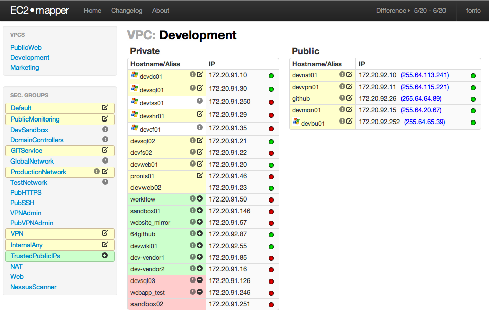
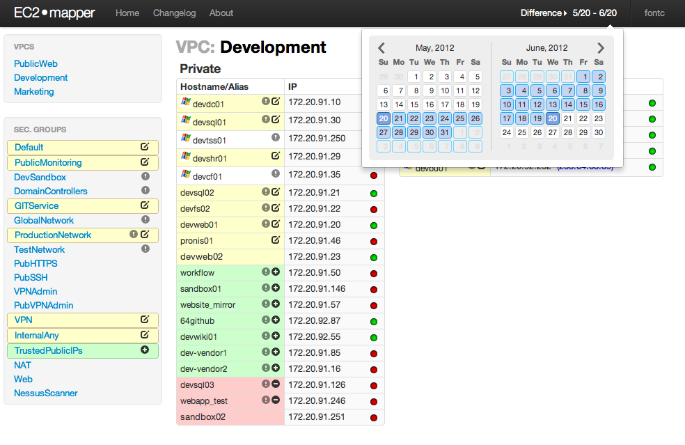
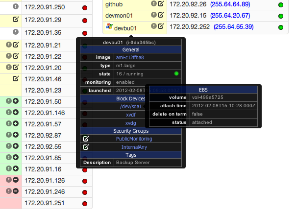
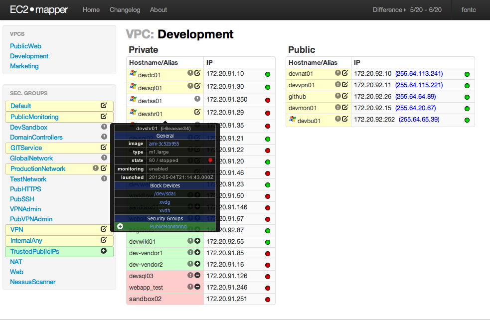

## EC2mapper

EC2mapper is a web application that provides a user-friendly interface to view Amazon AWS network configurations, while allowing changes to be easily tracked over time.  A daemon process periodically pulls a snapshot of all relevant information via the AWS API which is timestamped and stored into a database.  The default view will show the last snapshot retrieved -- the user can then go back in time and view the state of the network at a previous date, or select a range of days to see what was added/removed/modified within that range.

### Installation

Prerequisites:

- [node.js](http://nodejs.org/)
- [MongoDB](http://www.mongodb.org/)

Run the following command to checkout the latest copy

    git clone http://github.com/CFPB/ec2mapper
    
Copy or rename the server-settings.example.json file to server-settings.json and update the settings for your environment.  At a minimum you must include values for the following:

- ```webserver.sessionKey``` - used for securely tracking user sessions, must be a long hexadecimal string
- ```aws.accessKey and aws.secretKey``` - Keys used to connect to Amazon API

### Running EC2mapper

EC2mapper depends on two processes to run: the webserver and the fetcher.  

The fetcher runs as a daemon and periodically queries Amazon and grabs a current snapshot of the configuration.  The times at which it does the pull is controlled using a [cron-syntax](http://help.sap.com/saphelp_xmii120/helpdata/en/44/89a17188cc6fb5e10000000a155369/content.htm) string defined in server-settings.json. 

To run the fetcher:

    node fetch_aws_snapshot.js
    
The webserver simply serves the web application on whichever port you specify (port 8080 by default).

To run the webserver:

    node ec2mapper-main.js
    
Note that it is highly recommended that you use some method of monitoring and restarting these processes should they fail as well as to start/stop the application.  A well-known tool typically used for node.js is called `forever` and may be installed using npm by running `npm install -g forever` (please see their [documentation](https://github.com/nodejitsu/forever/#usage) on usage).  You may also simply use a more traditional `init.d` script to control starting/stopping.

Also note that EC2mapper does not provide any kind of authentication, if you require user auth you must implement it either in a proxy upstream or by modifying the source and including an authentication middleware.

### Screenshots

Main page of EC2mapper showing VPCs and security groups (left side) and all instances belonging to currently selected VPC (main area).  Green, red, and yellow highlighting denote security groups and instances that have been added, removed or changed respectively within a user-specified date range.
<br><br>

Dropdown calendar opened to show date range selection.
<br><br>

Clicking on an instance will display a popup with details.
<br><br>

Popup for a changed instance showing a security group in green to which it has been assigned.
<br><br>
